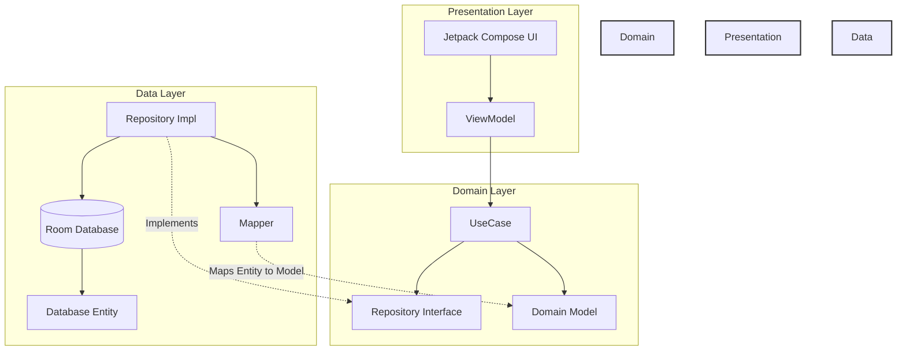
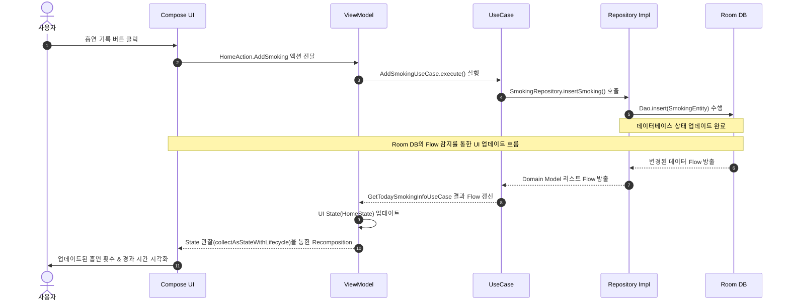

# My Smoking Log (나만의 흡연 기록)

**My Smoking Log**는 사용자가 자신의 흡연 습관을 기록하고, 시각화된 통계를 통해 흡연량을 관리할 수 있도록 돕는 안드로이드 애플리케이션입니다. 최신 안드로이드 기술 스택인 **Jetpack Compose**와 **Clean Architecture**를 기반으로 개발되었습니다.

## 📱 주요 기능 (Features)

### 1. 홈 (Home)
- **실시간 기록**: 버튼 클릭 한 번으로 흡연 시간을 기록합니다.
- **타이머**: 마지막 흡연으로부터 경과한 시간을 실시간으로 보여줍니다 (예: "2시간 30분 지남").
- **일일 현황**: 오늘의 흡연 개수와 설정된 일일 제한량을 비교하여 보여줍니다.

### 2. 통계 (Statistics)
**데이터 시각화와 분석을 통해 흡연 패턴을 파악합니다.**
- **주간 흡연량**: 지난 7일간의 흡연량을 막대 그래프(Bar Chart)로 시각화합니다.
- **오늘의 분포**: 하루 24시간 중 언제 흡연했는지를 점 그래프(Dot Chart)로 보여줍니다.
- **월간 리포트**: 이번 달 총 흡연 개수와 예상 비용을 계산합니다.
- **스트릭(Streak)**: 현재 금연 지속 일수와 역대 최장 금연 시간 기록을 추적합니다.
- **반응형 업데이트**: 홈 화면에서 기록을 추가하거나 설정을 변경하면 통계 화면에 즉시 반영됩니다.

### 3. 설정 (Settings)
- **일일 목표**: 하루 최대 흡연 개수 목표를 설정합니다.
- **담배 가격**: 한 갑당 가격을 설정하여 월간 비용을 정확히 계산합니다.

---

## 🛠 기술 스택 (Tech Stack)
- **Language**: Kotlin
- **UI Toolkit**: [Jetpack Compose](https://developer.android.com/jetbrains/compose) (Material3 Design)
- **Architecture**: Clean Architecture (Presentation - Domain - Data) + MVVM Pattern
- **Dependency Injection**: [Hilt](https://dagger.dev/hilt/)
- **Asynchronous**: Coroutines & [Flow](https://kotlin.github.io/kotlinx.coroutines/kotlinx-coroutines-core/kotlinx.coroutines.flow/)
- **Local Database**: [Room](https://developer.android.com/training/data-storage/room)

---

## 📂 모듈 구조 (Module Structure)

이 프로젝트는 현재 **단일 모듈 (Monolithic `:app`)** 구조이지만, 관심사의 완벽한 분리를 위해 패키지 레벨에서 독립된 레이어 구조를 가집니다. 이는 향후 기능 단위의 멀티 모듈로 쉽게 마이그레이션할 수 있도록 설계되었습니다.

```text
MySmokingLog (Root)
├── app (Application Module)
│   └── src/main/java/com/devhjs/mysmokinglog
│       ├── core            # 공통 유틸리티, 라우팅 및 DI 모듈
│       │   ├── di          # Hilt 의존성 주입 정의
│       │   ├── routing     # 네비게이션 및 화면 라우팅
│       │   └── util        # 유틸리티성 함수 및 확장
│       ├── data            # 데이터 소스 및 저장소 구현체
│       │   ├── local       # Room Database, Entity 및 DAO
│       │   ├── mapper      # 데이터 Entity와 도메인 모델 간 변환
│       │   └── repository  # domain 레포지토리 인터페이스 구현
│       ├── domain          # 순수 비즈니스 로직 (의존성 없음)
│       │   ├── model       # 순수 코틀린 데이터 모델
│       │   ├── repository  # 레포지토리 인터페이스 정의
│       │   └── usecase     # 단일 책임 유스케이스
│       └── presentation    # Jetpack Compose UI 및 ViewModel
│           ├── component   # 공통 커스텀 Composable 컴포넌트
│           ├── designsystem # 테마, 색상, 타이포그래피 등 디자인 시스템
│           ├── main        # 메인 진입점 및 네비게이션 호스트
│           └── [feature]   # 각 기능별 화면 (home, stat, setting, health 등)
```

---

## 🏗 앱 구조 & 아키텍처 (App Architecture)

**Clean Architecture** 원칙을 엄격하게 적용하여 관심사를 분리하고, 비즈니스 로직(`domain`)이 프레임워크나 외부 데이터베이스(`data`, `presentation`)에 의존하지 않도록 의존성 역전 원칙(DIP)을 따릅니다.

### 레이어 간 의존성 다이어그램


### Layer별 역할
1. **Presentation Layer (`:app/presentation`)**
   - **UI**: Jetpack Compose와 Material3를 활용하여 직관적이고 반응성 높은 화면을 구성합니다.
   - **ViewModel**: 사용자의 액션(Action)을 수신하고, UseCase를 통해 비즈니스 로직을 처리한 뒤, 그 결과를 반응형 `StateFlow`를 통해 UI 상태(State)로 전달합니다.
2. **Domain Layer (`:app/domain`)**
   - **UseCase**: 앱의 비즈니스 로직을 담고 있는 최소 단위입니다. (예: `GetStatUseCase`는 통계를 계산하고 분석함)
   - **Repository Interface**: Data Layer와의 결합도를 낮추기 위해 정의된 인터페이스로, 의존성 역전을 실현합니다.
   - **Model**: 안드로이드 플랫폼 의존성이 전혀 없는 순수 코틀린 데이터 클래스입니다.
3. **Data Layer (`:app/data`)**
   - **Repository Impl**: Domain Layer의 Repository 인터페이스를 실제로 구현하며, 데이터 소스(Local DB)를 제어합니다.
   - **Local DB (Room)**: 로컬 기기에 데이터를 지속적으로 저장 및 조회하는 실제 데이터 소스입니다.
   - **Mapper**: DB 엔티티(`Entity`)를 비즈니스 도메인 모델(`Model`)로 변환하여 레이어 간 데이터 격리를 보장합니다.

---

## 🔄 데이터 흐름 (Data Flow)

이 프로젝트는 예측 가능한 데이터 관리와 디버깅 편의성을 위해 **단방향 데이터 흐름(Unidirectional Data Flow - UDF)** 방식을 채택하고 있습니다.

### 데이터 흐름 시퀀스 다이어그램


---

## 💉 의존성 주입 (Dependency Injection)

객체 간의 결합도를 낮추고 테스트 용이성을 극대화하기 위해 **Dagger-Hilt**를 사용해 의존성을 주입합니다. 모든 의존성은 컴포넌트의 수명 주기에 맞추어 Hilt 컨테이너에 의해 관리됩니다.

### DI 모듈 및 스코프
- **`DatabaseModule`** (`@InstallIn(SingletonComponent::class)`)
  - **제공 의존성**: `AppDatabase`, `SmokingDao`, `UserSettingsDao`
  - **특징**: 싱글톤 스코프(`@Singleton`)로 앱 전역에서 유일한 데이터베이스 인스턴스를 유지합니다.
- **`RepositoryModule`** (`@InstallIn(SingletonComponent::class)`)
  - **제공 의존성**: `SmokingRepository`, `UserSettingRepository`, `HealthMilestoneRepository`
  - **특징**: 인터페이스와 구현체 간 바인딩을 위해 `@Binds` 어노테이션을 사용하여 의존성 역전을 실현합니다.
- **`TimeModule`** (`@InstallIn(SingletonComponent::class)`)
  - **제공 의존성**: `Clock`
  - **특징**: 시간 계산 로직에 사용되는 시스템 시계(`Clock.systemDefaultZone()`)를 주입하여 단위 테스트 시 모킹(Mocking)을 용이하게 합니다.

---
